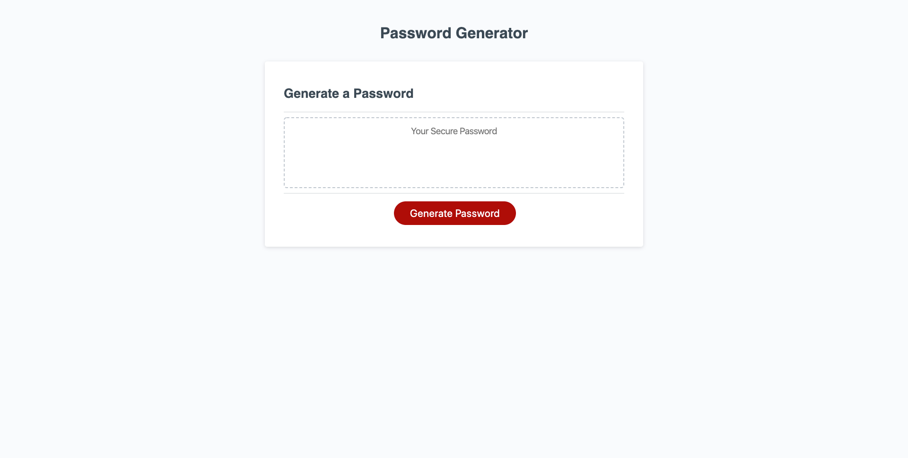
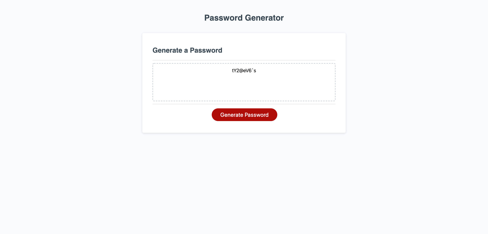
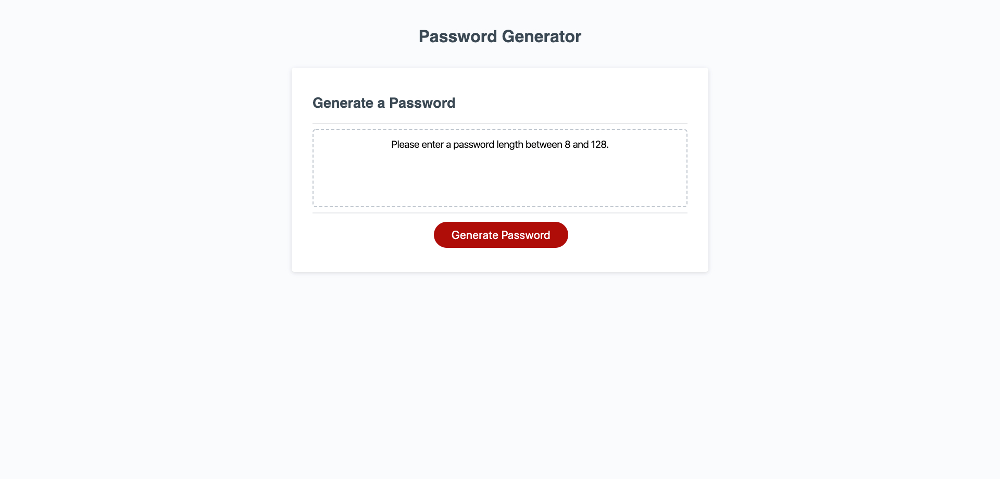

    

# Password-Generator

    Click the Generate Password button to generate a password! 
    The first prompt will ask you the length of the password you wish to create. Enter a number between 8 and 128. 
    The second will ask if you would like to include lowercase letter. Press Ok for Yes or Cancel for No. 
    The third will ask if you would like to include uppercase letters. 
    The fourth will ask if you would like to include numbers.
    The fifth and last prompt will ask if you would like to include special characters!

    The generator will display a random password made of the length and characters you chose. 
    If you click the Generate Password button again the Password Generator starts again!

## Example of password length 9
    
    

    I selected a length of 9 and included lowercase, uppercase, numeric, and special characters.

## If a password length is not between 8 and 128

    

    I selected cancel when prompted to enter a password length. 
    The same output would appear if I was to enter a length less than 8 or greater than 128.
